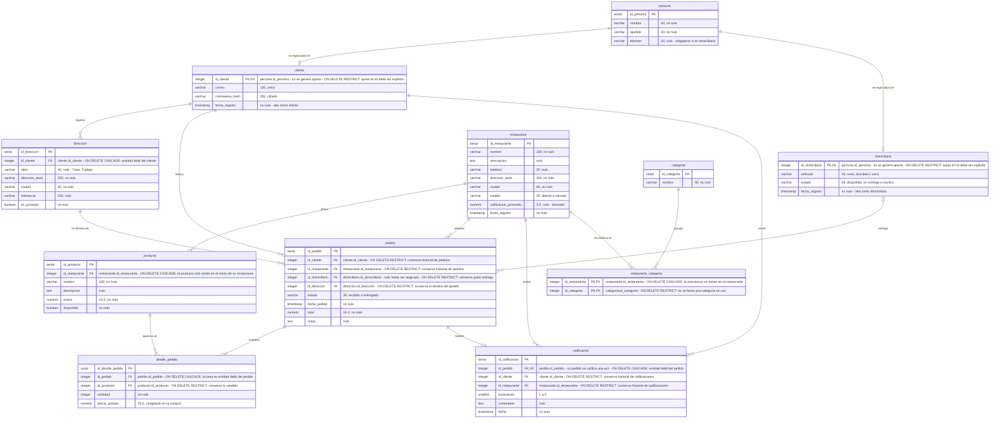

```mermaid

erDiagram
    persona ||--o| cliente : "se especializa en"
    persona ||--o| domiciliario : "se especializa en"
    cliente ||--o{ direccion : "registra"
    cliente ||--o{ pedido : "realiza"
    cliente ||--o{ calificacion : "emite"
    direccion ||--o{ pedido : "es destino de"
    restaurante ||--o{ producto : "ofrece"
    restaurante ||--o{ pedido : "prepara"
    restaurante ||--o{ calificacion : "recibe"
    restaurante ||--o{ restaurante_categoria : "se clasifica en"
    categoria ||--o{ restaurante_categoria : "agrupa"
    domiciliario |o--o{ pedido : "entrega"
    pedido ||--|{ detalle_pedido : "contiene"
    producto ||--o{ detalle_pedido : "aparece en"
    pedido ||--o| calificacion : "habilita"

    persona {
        serial id_persona PK
        varchar nombre "60, no nulo"
        varchar apellido "60, no nulo"
        varchar telefono "20, nulo - obligatorio si es domiciliario"
    }

    cliente {
        integer id_cliente PK,FK "persona.id_persona - no se genera aparte - ON DELETE RESTRICT: quitar el rol debe ser explicito"
        varchar correo "120, unico"
        varchar contrasena_hash "255, cifrada"
        timestamp fecha_registro "no nulo - alta como cliente"
    }

    direccion {
        serial id_direccion PK
        integer id_cliente FK "cliente.id_cliente - ON DELETE CASCADE: entidad debil del cliente"
        varchar alias "40, nulo - Casa, Trabajo"
        varchar direccion_texto "200, no nulo"
        varchar ciudad "60, no nulo"
        varchar referencia "150, nulo"
        boolean es_principal "no nulo"
    }

    restaurante {
        serial id_restaurante PK
        varchar nombre "100, no nulo"
        text descripcion "nulo"
        varchar telefono "20, nulo"
        varchar direccion_texto "200, no nulo"
        varchar ciudad "60, no nulo"
        varchar estado "20, abierto o cerrado"
        numeric calificacion_promedio "3-2, nulo - derivado"
        timestamp fecha_registro "no nulo"
    }

    categoria {
        serial id_categoria PK
        varchar nombre "50, no nulo"
    }

    restaurante_categoria {
        integer id_restaurante PK,FK "restaurante.id_restaurante - ON DELETE CASCADE: la asociacion no existe sin el restaurante"
        integer id_categoria PK,FK "categoria.id_categoria - ON DELETE RESTRICT: no se borra una categoria en uso"
    }

    producto {
        serial id_producto PK
        integer id_restaurante FK "restaurante.id_restaurante - ON DELETE CASCADE: el producto solo existe en el menu de su restaurante"
        varchar nombre "100, no nulo"
        text descripcion "nulo"
        numeric precio "10-2, no nulo"
        boolean disponible "no nulo"
    }

    domiciliario {
        integer id_domiciliario PK,FK "persona.id_persona - no se genera aparte - ON DELETE RESTRICT: quitar el rol debe ser explicito"
        varchar vehiculo "20, moto, bicicleta o carro"
        varchar estado "20, disponible, en entrega o inactivo"
        timestamp fecha_registro "no nulo - alta como domiciliario"
    }

    pedido {
        serial id_pedido PK
        integer id_cliente FK "cliente.id_cliente - ON DELETE RESTRICT: conserva historial de pedidos"
        integer id_restaurante FK "restaurante.id_restaurante - ON DELETE RESTRICT: conserva historial de pedidos"
        integer id_domiciliario FK "domiciliario.id_domiciliario - nulo hasta ser asignado - ON DELETE RESTRICT: conserva quien entrego"
        integer id_direccion FK "direccion.id_direccion - ON DELETE RESTRICT: conserva el destino del pedido"
        varchar estado "30, recibido a entregado"
        timestamp fecha_pedido "no nulo"
        numeric total "10-2, no nulo"
        text notas "nulo"
    }

    detalle_pedido {
        serial id_detalle_pedido PK
        integer id_pedido FK "pedido.id_pedido - ON DELETE CASCADE: la linea es entidad debil del pedido"
        integer id_producto FK "producto.id_producto - ON DELETE RESTRICT: conserva lo vendido"
        integer cantidad "no nulo"
        numeric precio_unitario "10-2, congelado en la compra"
    }

    calificacion {
        serial id_calificacion PK
        integer id_pedido FK,UK "pedido.id_pedido - un pedido se califica una vez - ON DELETE CASCADE: entidad debil del pedido"
        integer id_cliente FK "cliente.id_cliente - ON DELETE RESTRICT: conserva historial de calificaciones"
        integer id_restaurante FK "restaurante.id_restaurante - ON DELETE RESTRICT: conserva historial de calificaciones"
        smallint puntuacion "1 a 5"
        text comentario "nulo"
        timestamp fecha "no nulo"
    }
```
